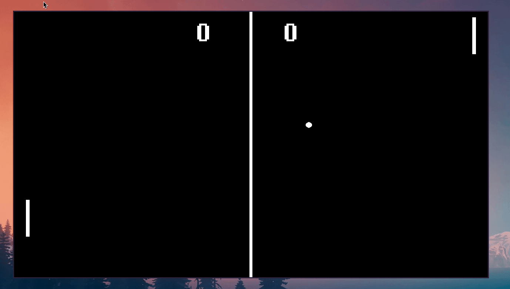
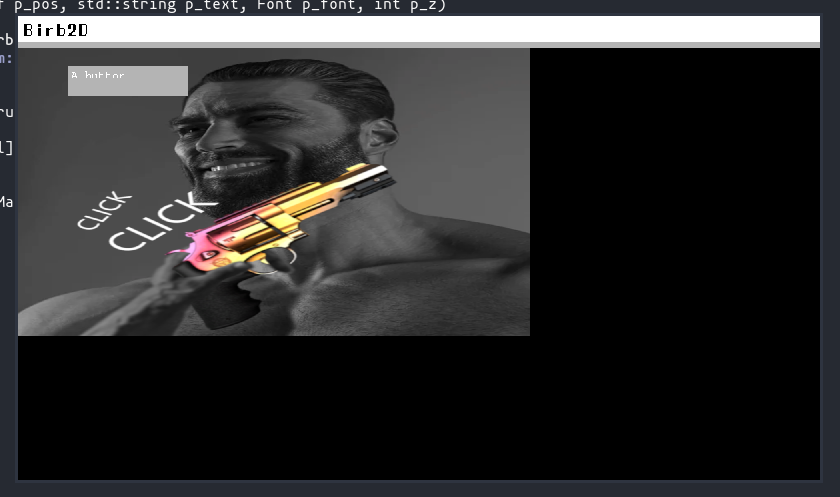

;title=Birb2D
;navlink=Birb2D

;header=page-top
# Birb2D
---
## Links
* [Github](https://github.com/Toasterbirb/Birb2D)
* [Documentation](https://birb2d.toasterbirb.com)

## Games
* [Flappy Birb](https://github.com/Toasterbirb/Flappy-Birb) (Finished, running with the first iteration of the engine)
* [Ping Pong](https://github.com/Toasterbirb/Birb2D/tree/main/games/Ping-Pong) (WIP)

## Table of contents
* [Why u do dis](#why)
* [Current progress](#progress)
	* [Pictures / Media](#media)
* [Goals](#goals)
* [Contributors](#contributors)
<break>

---

;header=why
## Why u do dis
This is probably going to be a classic forever project. I have been into video games ever since I found out about computers and at some point also wanted to start making my own games. Birb2D is the culmination of this passion. I have made some small games in the past. Just a few were finished though as happens with inspiring indie devs. [This ludum dare game](https://ldjam.com/events/ludum-dare/43/studyhard) is probably the only one I have ever finished and been happy with.
<break>
Then at some point I got into Linux and lower level programming languages like C and C++. I already had a little bit of experience in C++, but that was mostly working with winapi on windows. Unity wasn't an option on Linux (I know I know... they have a Linux release but **IT SUCKS**). Also C# is so full of Microsoft's shenanigans, that it is really difficult to use on Linux. I tried out Godot but it didn't feel like my jam. So end of game dev career then? Nah... Introducing **Birb2D**.

;header=progress
## Current progress
Birb2D is still in its infancy, but progress feels fast (like always in the beginning of any project). There are a lot of parts that I want to rewrite at some point though. There have been a lot of things I have learnt while making the game engine and then want to apply that back to the core components of the engine. Its like some sort of loop: Develop stuff -> Learn while doing it -> Start over because you can now do it better

<break>

;header=media
### Pictures / Media

	
[GIF] Flappy birb

	
[GIF] Pong

	
Application for widget testing

;header=goals
## Goals
This is an important part in this kind of projects. Too big scope is a sure way to kill any project that isn't paying your bills. This list might not be complete, but is the most descriptive way to show of what is currently being worked on or is under planning.
<break>
### Things that are required or just nice to have
* Basic rendering system
	* Textures / Sprites
	* Animations
* Audio
	* Music
	* Sound effects
* UI
	* Different HUD elements to build different menus etc.
	* Graphical editor to generate UI layouts
* Physics
	* Box2D integration (my math skills aren't advanced enough to write my own physics engine yet)
* File IO
	* Saving and loading data, possibly in JSON format
	* File format to save UI layouts to be loaded during runtime
* Scripting language (LUA for example) to make adding game behaviour easier
	* Most likely not going to happen any time soon. Its way too early to guess at all how this would be implemented in the current state of things
* Documentation
	* I don't want to be the only one who can figure out how to use this thing :D
	* Automated system to read code comments of certain style to generate documentation for important functions
* ... possibly more?

;header=contributors
## Contributors
There has been interest in helping with this project. Amazing right? :O
* Me 🐦 [Github](https://github.com/Toasterbirb)
* thatnerdjosh [Github](https://github.com/thatnerdjosh)

[Back to the top of the page](#page-top)
