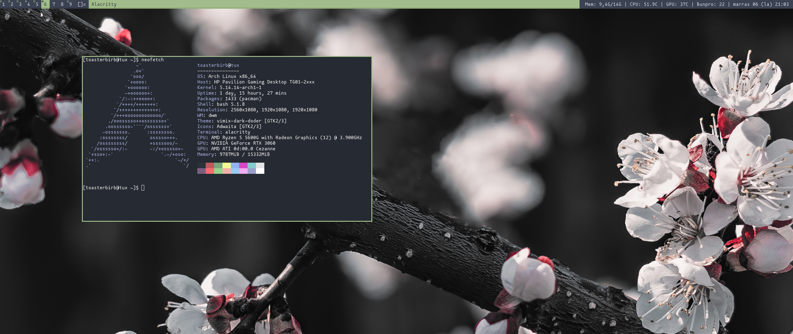
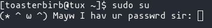

;title=Dotfiles
;navlink=Dotfiles

# Dotfiles
---
As a GNU/Linux user, I am obligated to share my dotfiles (hidden files with . in the beginning of the name, usually configuration files in ~/.config). I'll also put in other stuff that might matter.
<br><br>


<br><br>
**OS**: [Arch Linux](https://archlinux.org/)\
**Shell**: bash\
**Icons**: Adwaita\
**Font**: [mononoki](https://madmalik.github.io/mononoki/)\
Wallpaper: [link](./pics/wallpaper.jpg)\
**Colorscheme**: [nord](https://www.nordtheme.com/)\
**Window manager**: [dwm](https://github.com/Toasterbirb/dde/tree/dev)\
**GTK Theme**: [Vimix dark](https://www.opendesktop.org/s/Gnome/p/1013698/)\
**Terminal**: [Alacritty](https://github.com/alacritty/alacritty) [alacritty.yml](./dotfiles/alacritty.yml)\
Filemanager: [lf](https://github.com/gokcehan/lf) [lfrc](./dotfiles/lfrc) [lp.sh](./dotfiles/lp.sh) [lfcd.sh](./dotfiles/lfcd.sh)\
<br>
**Shell prompt**: `PS1='[\u@\h \W]\$ '`\
<br>

---

## Notable lines in .bashrc
<details>
	<summary>Translate Swedish text (or other languages) in pictures</summary>
	
#### Dependencies
- tesseract
- scrot
- [translate-shell](https://www.soimort.org/translate-shell/)

#### Code
```block
alias swe='scrot -s /tmp/translate.png && \
trans -b swe:fi "$(tesseract -l swe /tmp/translate.png stdout 2>/dev/null)" && \
	rm /tmp/translate.png'
```

#### Usage
Run the `swe` alias (or make this a script that is in PATH), select the area you want to translate and the translation should show up in the terminal. If you are going to make this into a script, you will need another way to show the translation (dunst etc.)
<br><br>
</details>

<details>
	<summary>Cute root password prompt</summary>

#### Dependencies
- sudo (there might be some similar variable for doas)

#### Code
```block
export SUDO_PROMPT="(* ^ ω ^) Mayw I hav ur passwrd sir: "
```

#### Preview

</details>
